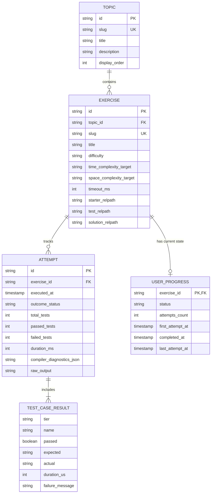
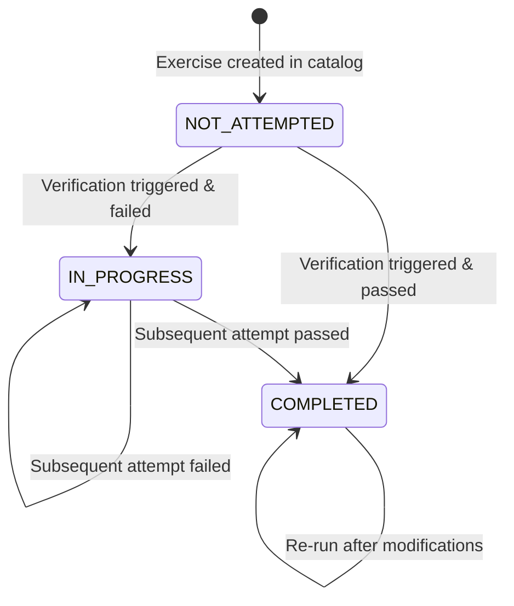

# Data Model: DSA Learning Platform

**Feature**: `001-dsa-learning-platform`  
**Date**: 2026-10-05  
**Status**: Complete  

## Overview

This document specifies the core entities, data structures, database schema, and state transitions for the local DSA learning platform.

---

## 1. Domain Entities



---

## 2. Entity Specifications

### 2.1 Topic
Represents a conceptual domain grouping related exercises (e.g., Arrays, Linked Lists, Trees, Dynamic Programming).

| Field | Type | Required | Description |
| :--- | :--- | :--- | :--- |
| `id` | string (UUID or slug) | Yes | Unique identifier for topic (e.g., `arrays-hashing`) |
| `title` | string | Yes | Human-readable title (e.g., "Arrays & Hashing") |
| `description` | string | Yes | Summary of algorithmic patterns covered |
| `display_order` | integer | Yes | Order in which topics are presented in curriculum |
| `exercises` | list[Exercise] | Yes | Ordered collection of exercises under this topic |

**Validation Rules**:
- `id` must be non-empty lowercase alphanumeric with hyphens (`^[a-z0-9-]+$`).
- `display_order` must be >= 0.

---

### 2.2 Exercise
Represents an individual C++ algorithm or data structure problem.

| Field | Type | Required | Description |
| :--- | :--- | :--- | :--- |
| `id` | string | Yes | Unique identifier (e.g., `two-sum`) |
| `topic_id` | string | Yes | Reference to parent topic |
| `slug` | string | Yes | URL and directory-friendly identifier |
| `title` | string | Yes | Problem title (e.g., "Two Sum") |
| `difficulty` | enum | Yes | `Easy` \| `Medium` \| `Hard` |
| `time_complexity_target` | string | Yes | Expected optimal time complexity (e.g., "$O(N)$") |
| `space_complexity_target` | string | Yes | Expected optimal space complexity (e.g., "$O(N)$") |
| `timeout_ms` | integer | Yes | Maximum execution time before TLE (default: 2000 ms) |
| `problem_markdown` | string | Yes | Markdown text with problem statement, constraints, examples |
| `starter_relpath` | string | Yes | Path to learner editable stub relative to workspace root |
| `test_relpath` | string | Yes | Path to protected test suite |
| `solution_relpath` | string | Yes | Path to canonical reference solution |

**Validation Rules**:
- `difficulty` must be one of `Easy`, `Medium`, or `Hard`.
- `timeout_ms` must be between 500 and 10000 ms.
- Referenced starter and test files must exist on disk.

---

### 2.3 Verification Result & Attempt
Captures the output of compiling and executing a learner's implementation against the exercise test suite.

| Field | Type | Required | Description |
| :--- | :--- | :--- | :--- |
| `id` | string | Yes | Unique attempt ID |
| `exercise_id` | string | Yes | Target exercise identifier |
| `timestamp` | string (ISO-8601) | Yes | Execution timestamp |
| `status` | enum | Yes | Verification outcome status |
| `tier_results` | list[TierResult] | Yes | Results grouped by verification tier |
| `summary` | ResultSummary | Yes | Counts: `total`, `passed`, `failed` |
| `duration_ms` | integer | Yes | Total execution time in milliseconds |
| `diagnostics` | list[CompilerDiagnostic] | No | Parsed compiler warnings/errors (if compile failed) |
| `raw_output` | string | No | Raw stdout/stderr for troubleshooting |

**Outcome Status Enum**:
- `PASSED`: All tests across all tiers succeeded.
- `FAILED`: Compilation succeeded, but one or more test assertions failed.
- `COMPILATION_ERROR`: `g++` compilation failed with syntax or type errors.
- `TIMEOUT`: Execution exceeded `timeout_ms` (Time Limit Exceeded).
- `RUNTIME_ERROR`: Process aborted or faulted (e.g., `SIGSEGV`, uncaught exception).

---

### 2.4 Compiler Diagnostic
Represents an individual parsed compiler error or warning from GCC.

| Field | Type | Required | Description |
| :--- | :--- | :--- | :--- |
| `file` | string | Yes | Source file path |
| `line` | integer | Yes | Line number (1-indexed) |
| `column` | integer | Yes | Column number (1-indexed) |
| `severity` | enum | Yes | `error` \| `warning` \| `note` |
| `raw_message` | string | Yes | Exact compiler error string |
| `explanation` | string | Yes | Beginner-friendly explanation of the issue |
| `suggestion` | string | No | Actionable hint or suggested fix |

---

### 2.5 Learner Progress
Represents aggregated user accomplishment, mastery, and history.

| Field | Type | Required | Description |
| :--- | :--- | :--- | :--- |
| `exercise_id` | string | Yes | Foreign key to Exercise |
| `status` | enum | Yes | `NOT_ATTEMPTED` \| `IN_PROGRESS` \| `COMPLETED` |
| `attempts_count` | integer | Yes | Total times verification was triggered |
| `first_attempt_at` | string (ISO) | No | When user first ran tests |
| `completed_at` | string (ISO) | No | When user first achieved `PASSED` status |
| `last_attempt_at` | string (ISO) | Yes | Timestamp of most recent attempt |

---

## 3. Database Schema (SQLite)

Stored at `.dsa/progress.db` locally:

```sql
CREATE TABLE IF NOT EXISTS exercises_progress (
    exercise_id TEXT PRIMARY KEY,
    status TEXT NOT NULL CHECK(status IN ('NOT_ATTEMPTED', 'IN_PROGRESS', 'COMPLETED')),
    attempts_count INTEGER NOT NULL DEFAULT 0,
    first_attempt_at TEXT,
    completed_at TEXT,
    last_attempt_at TEXT NOT NULL
);

CREATE TABLE IF NOT EXISTS verification_history (
    id TEXT PRIMARY KEY,
    exercise_id TEXT NOT NULL,
    executed_at TEXT NOT NULL,
    status TEXT NOT NULL,
    total_tests INTEGER NOT NULL,
    passed_tests INTEGER NOT NULL,
    failed_tests INTEGER NOT NULL,
    duration_ms INTEGER NOT NULL,
    diagnostics_json TEXT,
    FOREIGN KEY(exercise_id) REFERENCES exercises_progress(exercise_id)
);

CREATE INDEX IF NOT EXISTS idx_history_exercise ON verification_history(exercise_id);
```

---

## 4. State Transitions


