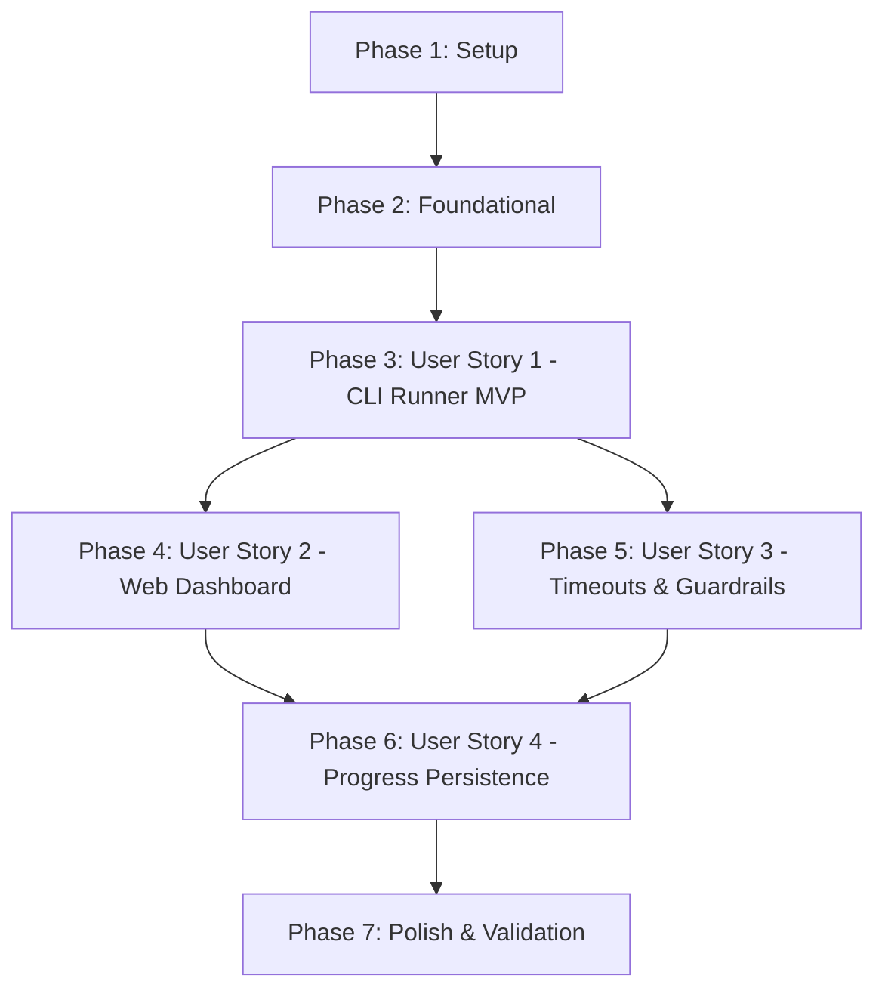

# Implementation Tasks: Local C++ DSA Learning Platform

**Feature**: `001-dsa-learning-platform`  
**Branch**: `001-dsa-learning-platform`  
**Plan**: [specs/001-dsa-learning-platform/plan.md](file:///home/yes/projects/dsa-learn/specs/001-dsa-learning-platform/plan.md)  
**Spec**: [specs/001-dsa-learning-platform/spec.md](file:///home/yes/projects/dsa-learn/specs/001-dsa-learning-platform/spec.md)  
**Design System**: [design-system/dsa-learn/MASTER.md](file:///home/yes/projects/dsa-learn/design-system/dsa-learn/MASTER.md)  

---

## Phase 1: Setup (Shared Infrastructure)

**Purpose**: Project initialization, directory structure, environment configuration, and frontend foundation.

- [X] T001 Create project directory structure for `dsa_learn/`, `curriculum/`, `exercises/`, `tests/`, and `frontend/` per plan
- [X] T002 [P] Initialize Python platform package configuration in `dsa_learn/config.py` with workspace root, default timeout (2000ms), and SQLite path (`.dsa/progress.db`)
- [X] T003 [P] Create CLI bash wrapper script in `./dsa-learn` with executable permissions delegating to `python3 -m dsa_learn`
- [X] T004 [P] Initialize React 19 + TypeScript + Vite frontend project configuration in `frontend/package.json`, `frontend/tsconfig.json`, and `frontend/vite.config.ts` (with proxy to `http://localhost:8080`)
- [X] T005 [P] Configure Tailwind CSS v4 and design system tokens matching OLED Dark Mode (`#0F172A` background, `#1E293B` card, JetBrains Mono / IBM Plex Sans) in `frontend/src/styles/globals.css`

---

## Phase 2: Foundational (Blocking Prerequisites)

**Purpose**: Core infrastructure that MUST be complete before ANY user story can be implemented.

**⚠️ CRITICAL**: No user story work can begin until this phase is complete.

- [X] T006 Create single-header zero-dependency C++ test harness in `dsa_learn/runner/harness/dsa_test.hpp` supporting `TEST_CASE`, `ASSERT_EQ`, `ASSERT_TRUE`, `BENCHMARK`, and JSON output
- [X] T007 [P] Implement SQLite database schema in `dsa_learn/storage/schema.sql` with `exercises_progress` (status CHECK `'NOT_ATTEMPTED', 'IN_PROGRESS', 'COMPLETED'`, default 0 attempts) and `verification_history`
- [X] T008 [P] Implement SQLite connection manager and repository in `dsa_learn/storage/db.py` to initialize tables, record attempts, and query progress
- [X] T009 [P] Implement GCC compiler wrapper and diagnostic sanitizer in `dsa_learn/runner/compiler.py` invoking `g++ -std=c++20 -O2 -Wall -Wextra -pedantic` and parsing errors into structured line/col/explanation objects
- [X] T010 [P] Define curriculum catalog schema and starter catalog in `dsa_learn/curriculum/catalog.json` listing 6 exercises across 4 topics (`two-sum`, `max-subarray`, `valid-palindrome`, `reverse-linked-list`, `invert-binary-tree`, `climbing-stairs`)
- [X] T011 Author canonical starter templates, verified solutions, problem markdown, and protected test suites for the 6 initial exercises in `dsa_learn/curriculum/topics/` and copy initial learner stubs into `exercises/`

**Checkpoint**: Foundation ready — user story implementation can now begin.

---

## Phase 3: User Story 1 - Local Exercise Completion & Automated Verification (Priority: P1) 🎯 MVP

**Goal**: Enable learner to open an exercise starter file locally in their editor, implement the algorithm, and trigger automated multi-tier C++ compilation and verification via CLI with immediate feedback.

**Independent Test**: Edit `exercises/arrays-hashing/two-sum/solution.cpp` (first unattempted, then solved), execute `./dsa-learn test two-sum`, and verify that multi-tier test results (functional correctness, boundary cases, complexity) report accurate pass/fail output and diagnostics within 3 seconds.

### Tests for User Story 1 ⚠️

- [X] T012 [P] [US1] Unit tests for compiler invocation and diagnostic sanitizer in `tests/test_compiler.py`
- [X] T013 [P] [US1] Integration tests for C++ multi-tier verification runner in `tests/test_runner.py`

### Implementation for User Story 1

- [X] T014 [US1] Implement execution runner in `dsa_learn/runner/executor.py` to compile user solution + protected test suite and execute binary with output capture
- [X] T015 [US1] Implement CLI command handler for `dsa-learn test [exercise_id]` in `dsa_learn/cli/test_cmd.py` displaying formatted terminal output for each tier
- [X] T016 [P] [US1] Implement CLI command handlers for `dsa-learn list` and `dsa-learn reset <exercise_id>` in `dsa_learn/cli/catalog_cmd.py`
- [X] T017 [US1] Wire CLI dispatcher in `dsa_learn/__main__.py` to route `test`, `list`, `reset`, and `version` commands

**Checkpoint**: At this point, User Story 1 (MVP) is fully functional and testable in the terminal.

---

## Phase 4: User Story 2 - Local Interactive Web Dashboard & Progress Monitoring (Priority: P2)

**Goal**: Serve an interactive, high-density React 19 + shadcn/ui web dashboard on `localhost:8080` that visualizes curriculum topics, problem descriptions, live verification runs, and progress metrics.

**Independent Test**: Launch `./dsa-learn serve`, open `http://localhost:8080`, navigate topics/problems, click "Run Verification", and confirm split-pane problem view, syntax-highlighted code, and live test output tabs render correctly.

### Tests for User Story 2 ⚠️

- [X] T018 [P] [US2] Unit and integration tests for local HTTP API routes in `tests/test_server.py`

### Implementation for User Story 2

- [X] T019 [US2] Implement lightweight Python HTTP API server and static file handler in `dsa_learn/server/app.py` and `dsa_learn/server/handlers.py` supporting `/api/topics`, `/api/exercises`, `/api/exercises/{id}`, `/api/exercises/{id}/run`, `/api/exercises/{id}/reset`, `/api/progress`, and static fallback to `frontend/dist/`
- [X] T020 [P] [US2] Implement filesystem watcher thread in `dsa_learn/server/watcher.py` monitoring `exercises/` mtime and streaming Server-Sent Events (SSE) via `GET /api/events`
- [X] T021 [P] [US2] Implement TypeScript API client and SSE subscription hook in `frontend/src/lib/api.ts` and `frontend/src/lib/useEvents.ts`
- [X] T022 [P] [US2] Create shadcn/ui base primitives (Button, Badge, Tabs, Card, ScrollArea) in `frontend/src/components/ui/`
- [X] T023 [P] [US2] Create resizable split-pane layout and header in `frontend/src/components/layout/ResizableLayout.tsx` and `frontend/src/components/layout/Header.tsx`
- [X] T024 [P] [US2] Create curriculum sidebar with topic accordion, difficulty badges, and search/filter in `frontend/src/components/curriculum/CurriculumSidebar.tsx`
- [X] T025 [P] [US2] Create markdown problem viewer with complexity badges and example test cases in `frontend/src/components/problem/ProblemViewer.tsx`
- [X] T026 [US2] Create live test runner drawer with tier tabs (Functional, Boundary, Complexity), progress indicators, and sanitized compiler diagnostic viewer in `frontend/src/components/runner/TestRunnerDrawer.tsx`
- [X] T027 [US2] Integrate main dashboard page state and keyboard shortcuts (`Ctrl+Enter` to run, `Ctrl+K` to search) in `frontend/src/App.tsx`
- [X] T028 [US2] Wire `./dsa-learn serve` CLI command in `dsa_learn/cli/serve_cmd.py` to start server and auto-open browser

**Checkpoint**: At this point, User Stories 1 AND 2 are fully functional and integrated.

---

## Phase 5: User Story 3 - Execution Resource Limits & Algorithmic Guardrails (Priority: P3)

**Goal**: Enforce deterministic execution timeouts per exercise and capture runtime faults (SIGSEGV, uncaught exceptions) safely without crashing the platform.

**Independent Test**: Submit an infinite loop solution (`while(true) {}`) and an invalid memory access solution, run verification via CLI/dashboard, and verify execution terminates within 2.0s with clear `Time Limit Exceeded` and `Runtime Error` diagnostics.

### Tests for User Story 3 ⚠️

- [X] T029 [P] [US3] Unit tests for timeout enforcement and segmentation fault signal handling in `tests/test_sandbox.py`

### Implementation for User Story 3

- [X] T030 [US3] Add process timeout enforcement (`timeout_ms` parameter from exercise metadata, default 2000ms) with hard kill in `dsa_learn/runner/executor.py`
- [X] T031 [US3] Add runtime signal inspection and memory fault parser (mapping `SIGSEGV`, `SIGABRT`, `SIGFPE` to human-readable explanations) in `dsa_learn/runner/executor.py`
- [X] T032 [US3] Add timeout and runtime fault UI callouts in `frontend/src/components/runner/TestRunnerDrawer.tsx`

**Checkpoint**: User Stories 1, 2, and 3 are functional with robust safety boundaries.

---

## Phase 6: User Story 4 - Local State & Offline Progress Persistence (Priority: P4)

**Goal**: Retain user completion history, attempt counts, and topic scores across restarts in `.dsa/progress.db` with zero cloud calls.

**Independent Test**: Complete an exercise, restart the platform, launch `./dsa-learn list` and web dashboard, and confirm completion badges and timestamps persist accurately offline.

### Tests for User Story 4 ⚠️

- [X] T033 [P] [US4] Integration tests for offline progress persistence across restarts in `tests/test_storage.py`

### Implementation for User Story 4

- [X] T034 [US4] Implement progress aggregation and topic mastery computation in `dsa_learn/storage/db.py`
- [X] T035 [US4] Implement solution reveal gate in `dsa_learn/server/handlers.py` and `dsa_learn/cli/catalog_cmd.py` requiring completed status or explicit confirmation (`confirm_reveal=true`)
- [X] T036 [US4] Add solution viewer dialog with Big-O complexity explanation in `frontend/src/components/problem/SolutionModal.tsx`
- [X] T037 [US4] Add overall progress mastery card and topic progress rings in `frontend/src/components/curriculum/ProgressOverview.tsx`

**Checkpoint**: All 4 user stories are fully implemented and verified.

---

## Phase 7: Polish & Cross-Cutting Concerns

**Purpose**: Production bundling, end-to-end validation, documentation, and pre-delivery checks.

- [X] T038 [P] Pre-build frontend production bundle to `frontend/dist/` via `npm run build` and verify fallback serving in `dsa_learn/server/app.py`
- [X] T039 [P] End-to-end execution of validation scenarios in `specs/001-dsa-learning-platform/quickstart.md`
- [X] T040 Verify UI/UX Pre-Delivery Checklist (contrast ratios, no emoji icons, keyboard focus, responsive layout) per `design-system/dsa-learn/MASTER.md`
- [X] T041 Add developer documentation and usage guide in `README.md`

---

## Dependencies & Execution Order

### Phase Dependencies

- **Setup (Phase 1)**: No dependencies — can start immediately.
- **Foundational (Phase 2)**: Depends on Phase 1 completion — **BLOCKS all user stories**.
- **User Story 1 (Phase 3)**: Depends on Phase 2. Delivers working terminal MVP.
- **User Story 2 (Phase 4)**: Depends on Phase 2 & Phase 3 runner primitives. Delivers web dashboard.
- **User Story 3 (Phase 5)**: Depends on Phase 3 runner executor. Enhances sandboxing and timeouts.
- **User Story 4 (Phase 6)**: Depends on Phase 2 database & Phase 4 dashboard views. Completes progress tracking.
- **Polish (Phase 7)**: Depends on all user stories being complete.

---

## Parallel Opportunities

- **Phase 1 (Setup)**: T002, T003, T004, T005 can all execute in parallel.
- **Phase 2 (Foundational)**: T007 (schema), T008 (db), T009 (compiler), T010 (catalog) can execute in parallel.
- **Phase 3 (User Story 1)**: Tests T012, T013 and catalog CLI T016 can execute in parallel.
- **Phase 4 (User Story 2)**: Frontend components T021, T022, T023, T024, T025, and backend T020 can execute in parallel.
- **Phase 7 (Polish)**: T038, T039, T040, T041 can execute in parallel.

---

## Implementation Strategy

### MVP First (Phases 1, 2, and 3)
1. Complete Phase 1 (Setup) and Phase 2 (Foundational).
2. Complete Phase 3 (User Story 1: CLI verification runner).
3. **STOP and VALIDATE**: Verify that learners can edit `exercises/arrays-hashing/two-sum/solution.cpp` and test it with `./dsa-learn test two-sum`. This represents a fully functional MVP terminal platform!

### Incremental Delivery (Web Dashboard & Polish)
1. Add Phase 4 (User Story 2: React 19 + shadcn/ui dashboard + live auto-run watcher).
2. Add Phase 5 (User Story 3: Sandboxing & execution timeouts).
3. Add Phase 6 (User Story 4: Offline persistence & mastery visualization).
4. Run Phase 7 (Pre-build distribution and validation guide).
