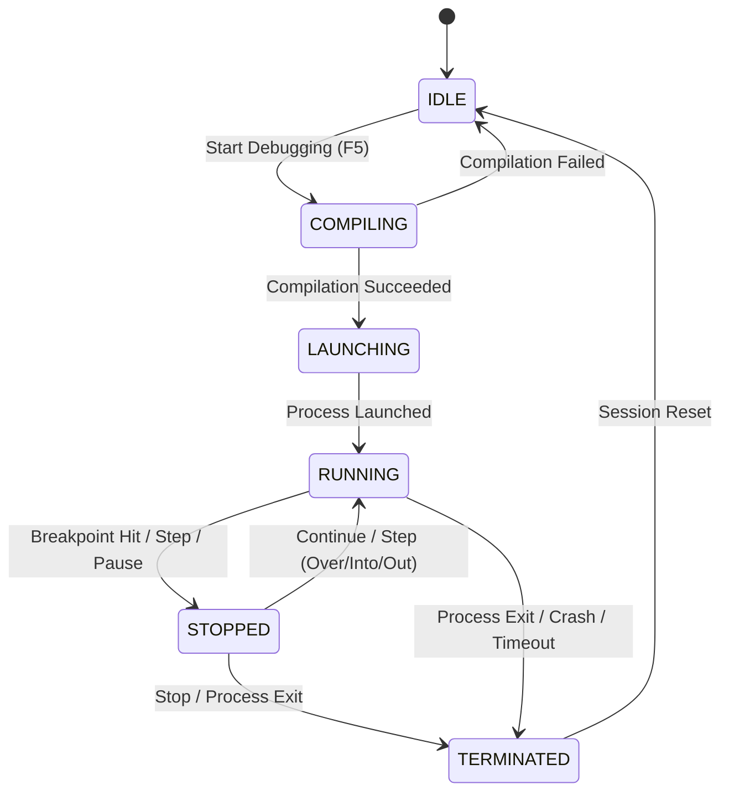
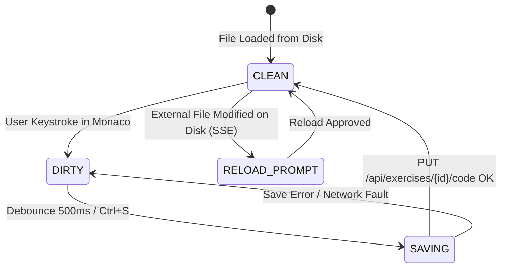

# Data Model: In-Browser Code Editor & Developer Environment

**Feature**: `specs/002-web-code-editor`  
**Status**: Completed  
**Date**: 2026-10-05  

This document formalizes the entities, state transitions, and validation rules governing the in-browser development environment.

---

## 1. Entities & Schemas

### 1.1 `EditorSession`
Represents an active code editor document in the browser.

| Field | Type | Description | Validation / Constraints |
|---|---|---|---|
| `exercise_id` | `string` | Identifier of active exercise | Must exist in curriculum catalog |
| `file_relpath` | `string` | Relative path to local C++ source file | Relative to workspace root; `.cpp` extension |
| `content` | `string` | Current text buffer content in Monaco | UTF-8 encoded string |
| `is_dirty` | `boolean` | True if buffer differs from disk file | Computed locally |
| `last_saved_at` | `timestamp` | ISO timestamp of last disk write | Valid ISO-8601 string |
| `revision` | `integer` | Monotonically increasing revision counter | Non-negative integer |

### 1.2 `LanguageIntelligenceSession`
Represents the LSP channel linking Monaco to the host's `clangd` instance.

| Field | Type | Description | Validation / Constraints |
|---|---|---|---|
| `session_id` | `string` | Unique identifier for LSP connection | UUIDv4 |
| `exercise_id` | `string` | Associated exercise | Must be active |
| `status` | `string` | Connection status | `CONNECTING`, `INITIALIZING`, `READY`, `ERROR`, `DISCONNECTED` |
| `diagnostics` | `DiagnosticItem[]` | Collection of active lint/error markers | Array of diagnostic objects |
| `capabilities` | `object` | LSP capabilities advertised by `clangd` | Standard LSP ServerCapabilities |

#### Sub-type: `DiagnosticItem`
- `line`: 1-based start line number (`integer >= 1`)
- `column`: 1-based start column (`integer >= 1`)
- `end_line`: 1-based end line number (`integer >= line`)
- `end_column`: 1-based end column (`integer >= 1`)
- `severity`: Severity level (`"error" | "warning" | "information" | "hint"`)
- `message`: Diagnostic description string
- `source`: Source provider (e.g., `"clangd"`)

### 1.3 `TerminalSession`
Represents an interactive pseudo-terminal process on the host workstation.

| Field | Type | Description | Validation / Constraints |
|---|---|---|---|
| `session_id` | `string` | Unique identifier for terminal session | UUIDv4 |
| `pid` | `integer` | Process ID of spawned shell on host | Valid host PID |
| `cols` | `integer` | Column geometry | Integer between 20 and 500 |
| `rows` | `integer` | Row geometry | Integer between 5 and 200 |
| `shell_cmd` | `string` | Executable path of host shell | Native shell (`/bin/bash`, `zsh`, `powershell.exe`, `cmd.exe`) |
| `cwd` | `string` | Working directory of terminal | Must resolve within workspace root |
| `status` | `string` | Terminal lifecycle state | `ACTIVE`, `CLOSING`, `TERMINATED` |

### 1.4 `DebugSession`
Represents an active debugging instance attached to a compiled exercise binary.

| Field | Type | Description | Validation / Constraints |
|---|---|---|---|
| `session_id` | `string` | Unique identifier for debug session | UUIDv4 |
| `exercise_id` | `string` | Associated exercise | Must exist |
| `target_binary` | `string` | Absolute path to debug executable (`-g -O0`) | Must exist and be executable |
| `state` | `string` | Debugger lifecycle state | `IDLE`, `COMPILING`, `LAUNCHING`, `RUNNING`, `STOPPED`, `TERMINATED` |
| `breakpoints` | `Breakpoint[]` | List of user breakpoints | Non-empty file path and line numbers |
| `stop_reason` | `string | null` | Reason for pausing | `"breakpoint" | "step" | "exception" | "pause" | null` |
| `current_frame` | `StackFrame | null` | Active execution frame when stopped | Null when running |
| `call_stack` | `StackFrame[]` | Current execution call stack | Populated when `state == STOPPED` |
| `scopes` | `Scope[]` | Scopes (Local, Global, Registers) | Populated when `state == STOPPED` |

#### Sub-type: `Breakpoint`
- `file`: Path to source file
- `line`: 1-based line number
- `verified`: Boolean indicating adapter accepted breakpoint

#### Sub-type: `StackFrame`
- `id`: Frame ID integer
- `name`: Function or symbol name
- `source`: File path
- `line`: Line number
- `column`: Column number

#### Sub-type: `Variable`
- `name`: Variable identifier
- `value`: Evaluated string representation
- `type`: C++ type name (e.g., `std::vector<int>`, `int*`)
- `variablesReference`: Reference integer for expandable nested objects/pointers

### 1.5 `CompileRunJob`
Represents an on-demand compilation and execution run (separate from test verification).

| Field | Type | Description | Validation / Constraints |
|---|---|---|---|
| `job_id` | `string` | Unique run identifier | UUIDv4 |
| `exercise_id` | `string` | Associated exercise | Must exist |
| `status` | `string` | Execution status | `PENDING`, `BUILDING`, `RUNNING`, `SUCCESS`, `COMPILATION_ERROR`, `TIMEOUT`, `RUNTIME_ERROR` |
| `compiler_output` | `string` | Raw build stdout and stderr | UTF-8 string |
| `program_output` | `string` | Execution standard output and stderr | UTF-8 string |
| `exit_code` | `integer | null` | Process exit code | Integer or null if timed out/building |
| `duration_ms` | `integer` | Total execution duration in milliseconds | Non-negative integer |

---

## 2. State Transitions

### 2.1 Debug Session Lifecycle

### 2.2 Editor File Synchronization Lifecycle

