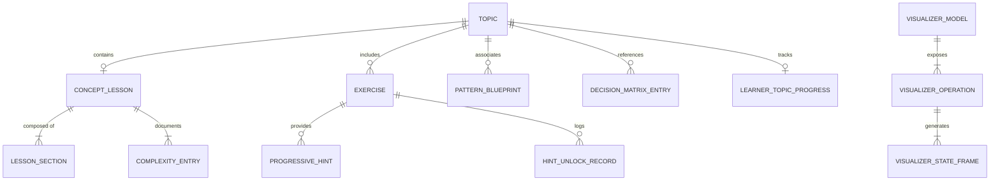
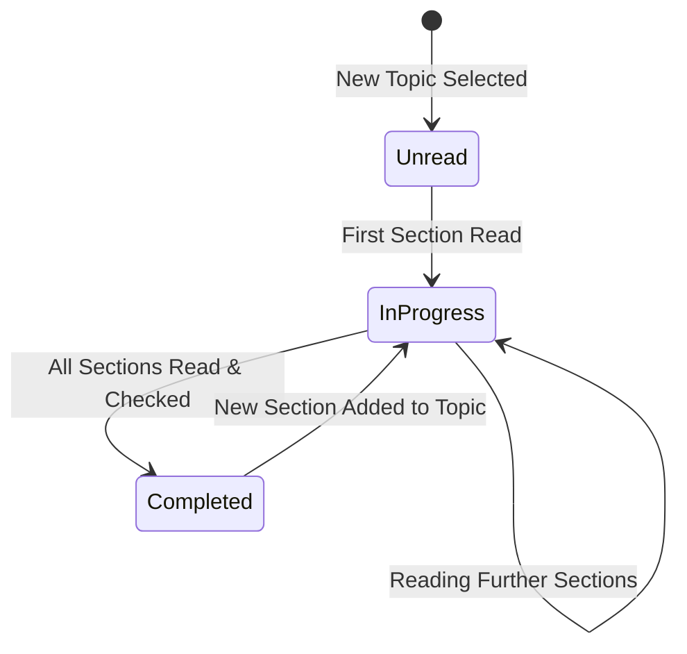
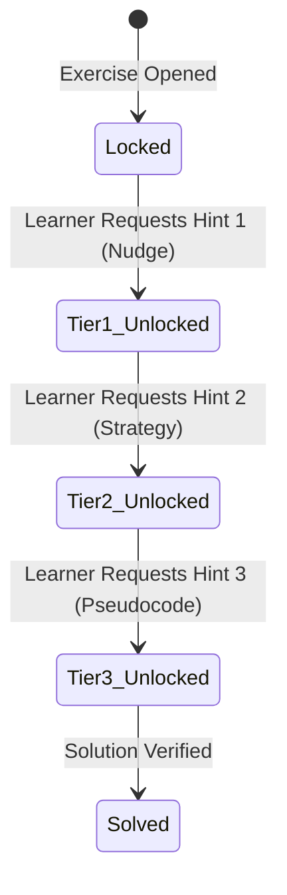
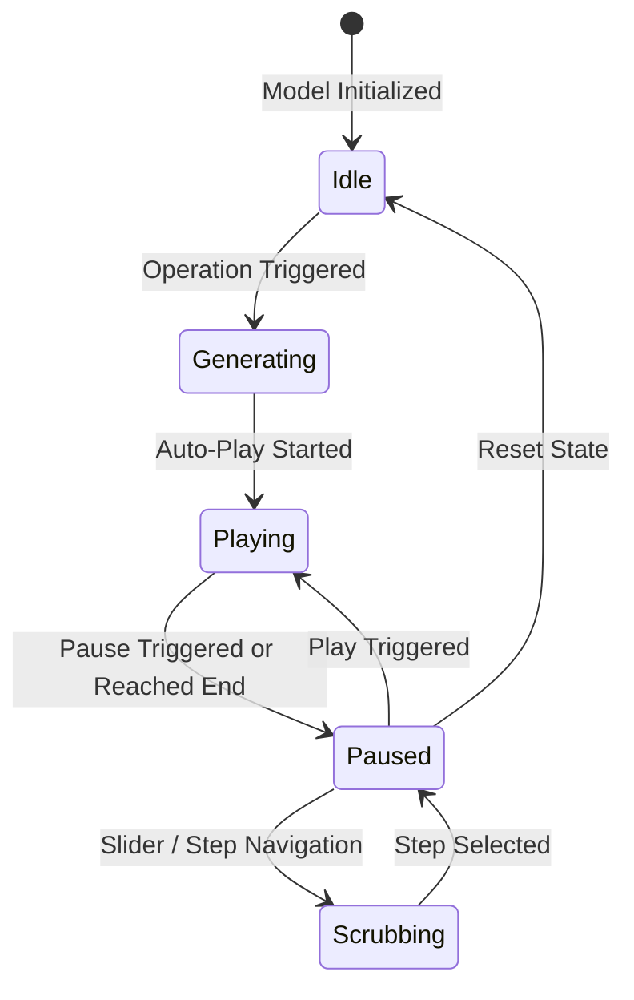

# Data Model: Interactive Concept Learning & DSA Pedagogy

**Feature**: `003-interactive-concept-learning`  
**Status**: Draft  
**Date**: 2026-10-05  

This document specifies the logical entities, data schemas, validation rules, relationships, and state transitions for the interactive learning and pedagogy features.

---

## 1. Entity Relationship Diagram



---

## 2. Core Entities & Schemas

### 2.1 Concept Lesson & Sections

A structured theoretical guide attached to a topic, providing pedagogical explanations before problem-solving.

```typescript
interface ConceptLesson {
  topic_id: string;              // Foreign key to Topic (e.g., 'linked-lists')
  title: string;                 // e.g., 'Singly & Doubly Linked Lists'
  summary: string;               // Executive summary for non-technical or beginner readers
  sections: LessonSection[];     // Ordered instructional modules
  complexity_matrix: ComplexityEntry[]; // Operational Big-O reference
}

interface LessonSection {
  id: string;                    // Slug identifier (e.g., 'memory-layout')
  title: string;                 // Section display title
  order: number;                 // Sequential display order (1, 2, 3...)
  estimated_minutes: number;     // Reading time estimate
  content_markdown: string;      // Formatted educational text, diagrams, and math
}

interface ComplexityEntry {
  operation: string;             // e.g., 'Prepend / Insert Head', 'Search', 'Append'
  best_time: string;             // Big-O (e.g., 'O(1)')
  average_time: string;          // Big-O (e.g., 'O(N)')
  worst_time: string;            // Big-O (e.g., 'O(N)')
  space_complexity: string;      // Auxiliary space (e.g., 'O(1)')
  notes: string;                 // Pedagogical rationale or memory trade-off
}
```

**Validation Rules**:
- `topic_id` must match a valid topic in `catalog.json`.
- `sections` must contain at least: `overview`, `memory-layout`, `core-operations`, and `tradeoffs`.
- Big-O notations must follow standard syntax (`O(1)`, `O(\log N)`, `O(N)`, `O(N^2)`, etc.).

---

### 2.2 Visualizer State Frame & Operation Model

Represents the state transitions produced by an interactive data structure simulation.

```typescript
type ActionType = 
  | 'INIT'
  | 'COMPARE'
  | 'POINTER_MOVE'
  | 'INSERT'
  | 'REMOVE'
  | 'SWAP'
  | 'HIGHLIGHT'
  | 'TRAVERSE'
  | 'SPLIT'
  | 'MERGE'
  | 'BALANCE';

type DataStructureType =
  | 'ARRAY'
  | 'LINKED_LIST'
  | 'STACK_QUEUE'
  | 'BINARY_SEARCH_TREE'
  | 'HEAP'
  | 'GRAPH';

interface VisualizerStateFrame {
  step_index: number;            // 0-indexed step number
  total_steps: number;           // Total frames in the execution trace
  action_type: ActionType;       // Semantic category of this step
  description: string;           // Explanatory commentary shown to learner
  data_structure_type: DataStructureType;
  
  // Polymorphic structure state snapshots
  array_state?: {
    elements: Array<{
      value: number | string;
      index: number;
      is_highlighted: boolean;
      status?: 'default' | 'active' | 'sorted' | 'candidate';
      label?: string;
    }>;
    pointers: Array<{
      name: string;              // e.g., 'left', 'right', 'mid'
      target_index: number;
      color: string;
    }>;
  };

  linked_list_state?: {
    nodes: Array<{
      id: string;
      value: number | string;
      next_id: string | null;
      prev_id?: string | null;
      is_highlighted: boolean;
      status?: 'default' | 'target' | 'visited';
      label?: string;
    }>;
    pointers: Array<{
      name: string;              // e.g., 'head', 'curr', 'prev'
      target_node_id: string | null;
      color: string;
    }>;
  };

  tree_state?: {
    nodes: Array<{
      id: string;
      value: number;
      left_id: string | null;
      right_id: string | null;
      is_highlighted: boolean;
      status?: 'default' | 'active' | 'found' | 'rotated';
      height?: number;
    }>;
    active_node_id: string | null;
  };

  heap_state?: {
    elements: Array<{
      value: number;
      index: number;
      is_highlighted: boolean;
    }>;
    swapping_indices: [number, number] | null;
  };
}

interface VisualizerOperation {
  id: string;                    // e.g., 'insert', 'search', 'delete', 'reverse'
  name: string;                  // Display title (e.g., 'Insert Node')
  description: string;
  parameters: Array<{
    name: string;
    label: string;
    type: 'number' | 'string' | 'boolean';
    default_value: any;
    min?: number;
    max?: number;
  }>;
  presets: Array<{
    name: string;                // e.g., 'Empty Tree', 'Skewed Left', 'Duplicates'
    description: string;
    initial_values: any[];
    operation_param: any;
  }>;
}
```

**Validation Rules**:
- `step_index` must be non-negative and strictly less than `total_steps`.
- Every frame must supply a non-empty `description` that explains the step in plain English.
- Custom numeric inputs must be constrained between `[-999, 999]` and maximum collection size capped at `30` elements to guarantee visual legibility.

---

### 2.3 Algorithmic Pattern Blueprint & Decision Matrix

Teaches algorithmic problem recognition and comparative trade-offs.

```typescript
interface PatternBlueprint {
  id: string;                    // e.g., 'two-pointers-opposite-ends'
  title: string;                 // e.g., 'Opposite-End Two Pointers'
  topic_ids: string[];           // Associated topics
  summary: string;
  trigger_cues: string[];        // Problem signals ("Sorted array", "Find pair with target sum")
  invariant_rules: string[];     // Loop invariants to uphold
  code_template_cpp: string;     // Canonical C++20 starter template
  common_pitfalls: string[];     // Off-by-one errors, infinite loops
  related_exercise_ids: string[];
}

interface DecisionMatrixEntry {
  id: string;                    // e.g., 'element-lookup'
  scenario: string;              // e.g., 'Frequent element lookup by key'
  candidates: Array<{
    structure_name: string;      // e.g., 'Hash Table', 'Balanced BST', 'Sorted Array'
    time_complexity: string;     // e.g., 'O(1) average', 'O(log N)'
    space_overhead: string;      // e.g., 'High (buckets & pointers)', 'Low (contiguous)'
    best_when: string;           // Guiding rationale
    avoid_when: string;          // Warning signal
    is_recommended: boolean;
  }>;
}
```

---

### 2.4 Progressive Hints & Foundation Exercises

Scaffolds learner problem-solving and foundational data structure construction.

```typescript
interface ProgressiveHint {
  tier: 1 | 2 | 3;
  type: 'NUDGE' | 'STRATEGY' | 'PSEUDOCODE';
  title: string;
  content_markdown: string;
}

interface ExerciseMetadataExtension {
  is_foundation: boolean;        // True if this is a "Build from Scratch" exercise
  target_component_methods?: string[]; // e.g., ['constructor', 'push_back', 'pop_back', 'resize']
  hints: ProgressiveHint[];
}
```

---

### 2.5 Learner Progress (SQLite Tables)

```sql
-- Tracks lesson section completion per topic
CREATE TABLE IF NOT EXISTS lesson_progress (
    topic_id TEXT PRIMARY KEY,
    completed_sections_json TEXT NOT NULL DEFAULT '[]', -- Array of section IDs
    last_read_section TEXT,
    reading_progress_pct INTEGER NOT NULL DEFAULT 0,
    completed_at TEXT,
    updated_at TEXT NOT NULL
);

-- Tracks hint tier unlocks to avoid spoiling and persist unlocks across reloads
CREATE TABLE IF NOT EXISTS hint_history (
    id TEXT PRIMARY KEY,
    exercise_id TEXT NOT NULL,
    tier INTEGER NOT NULL,
    unlocked_at TEXT NOT NULL,
    UNIQUE(exercise_id, tier)
);

-- Tracks visualizer operations explored by learner
CREATE TABLE IF NOT EXISTS visualizer_progress (
    topic_id TEXT PRIMARY KEY,
    explored_operations_json TEXT NOT NULL DEFAULT '[]', -- Array of operation IDs
    last_visited_at TEXT NOT NULL
);
```

---

## 3. State Lifecycles

### 3.1 Lesson Reading Lifecycle


### 3.2 Progressive Hint Unlock Lifecycle


### 3.3 Visualizer Playback Lifecycle

